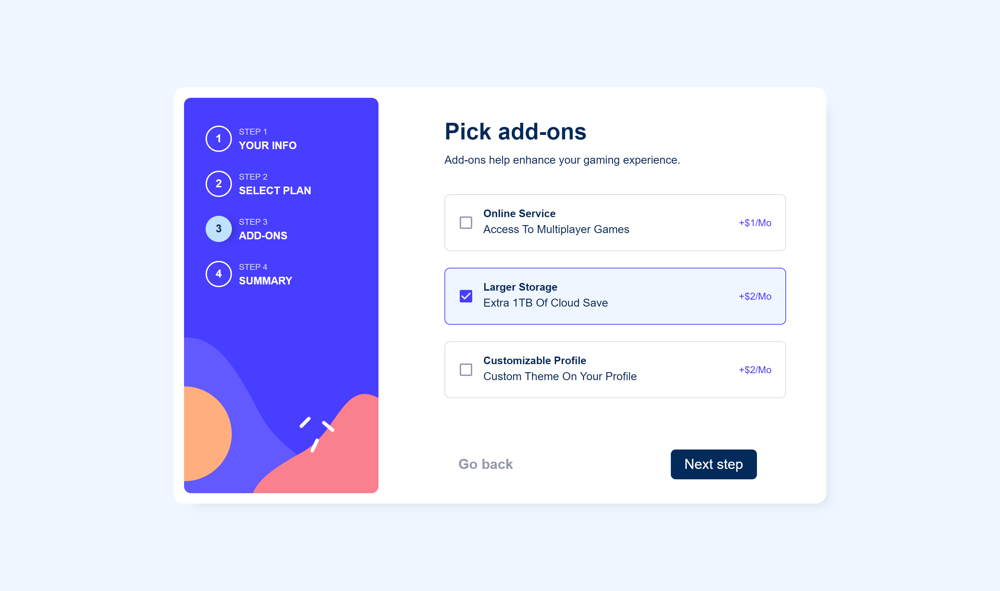
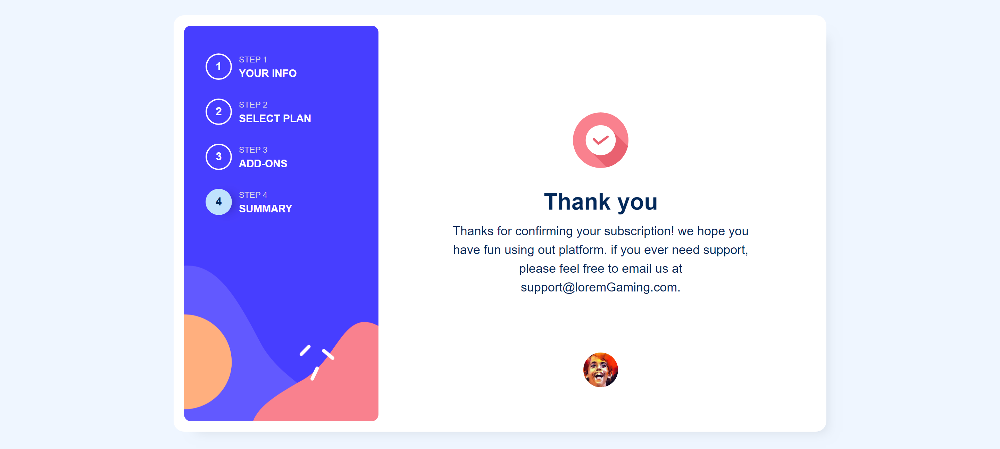
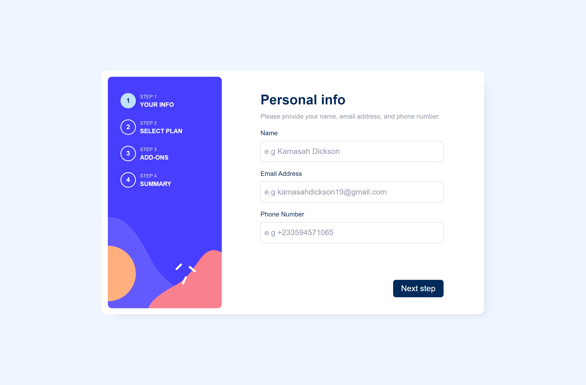
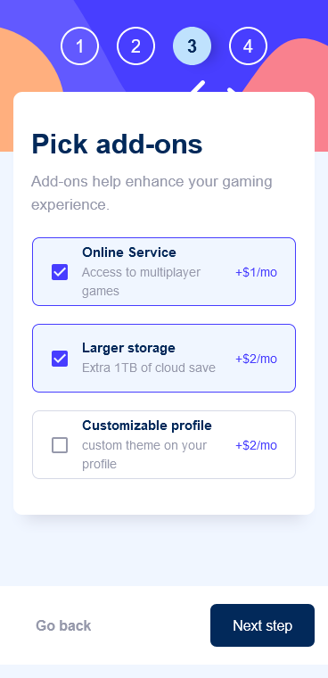

## Table of contents

- [Screenshot](#screenshot)
- [Links](#links)
- [My process](#my-process)
  - [Built with](#built-with)
  - [What I learned](#what-i-learned)
- [Author](#author)

### Screenshot






### Links

- Solution URL: [solution](https://github.com/Kamasah-Dickson/React-redesigned-enigma)
- Live Site URL: [live site](https://capable-sable-35c3fa.netlify.app/)

## My process

### Built with

- Semantic HTML5 markup
- Flexbox
- CSS Grid
- Mobile-first workflow
- [React](https://reactjs.org/) - JS library

### What I learned

```js
Object.entries(); //[key,value] pairs
Object.values(); //[value] pairs
```

## Author

- Frontend Mentor - [@Kamasah-Dickson](https://www.frontendmentor.io/profile/Kamasah-Dickson)
- Twitter - [@Kamasah-Dickson](https://twitter.com/Kamas_DEV)
